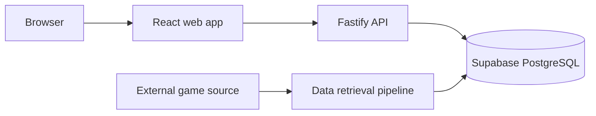

# Technical Documenting

## Purpose

Create accurate, maintainable engineering documentation grounded in the actual repository.

Always follow `AGENTS.md`, existing documentation conventions, and the code as the primary source of truth.

## Suitable documents

Use this skill for:

- architecture overview
- component or module design
- API reference
- database schema documentation
- data-retrieval pipeline documentation
- architecture decision records
- deployment guide
- environment and configuration reference
- security model
- observability guide
- incident or recovery runbook
- migration guide
- integration contract
- test strategy

Use `general-documenting` for introductory, user-facing, or non-specialist documentation.

## Evidence-first workflow

Before writing:

1. Read `AGENTS.md`, `README.md`, and relevant existing docs.
2. Inspect source code and configuration.
3. Trace actual flows across modules.
4. Inspect route schemas and handlers.
5. Inspect migrations and database access.
6. Inspect environment-variable usage.
7. Inspect tests for intended behaviour.
8. Inspect deployment or CI configuration where relevant.
9. Record uncertainty and conflicting sources.
10. Prefer current code and applied configuration over stale prose.

Do not guess technical details. Do not present planned architecture as implemented architecture.

## Documentation status

Clearly distinguish:

- **Current:** confirmed in the repository
- **Proposed:** recommended but not implemented
- **Deprecated:** retained temporarily
- **Historical:** no longer active
- **Unknown:** could not be verified

Include a last-reviewed date when appropriate.

## Architecture documentation

Document:

- system purpose and boundaries
- major components
- runtime relationships
- data flow
- external dependencies
- trust boundaries
- deployment topology
- failure points
- ownership
- important constraints

Use Mermaid diagrams when they improve comprehension and are supported.

Example:



Ensure diagrams match the text and current implementation.

## API documentation

For each endpoint include:

- method
- path
- purpose
- authentication
- authorisation
- path parameters
- query parameters
- request body
- validation
- success response
- error responses
- pagination
- idempotency
- example request
- example response

Never copy real tokens or secrets into examples.

## Database documentation

For each table include:

- purpose
- primary key
- columns and types
- nullability
- defaults
- unique constraints
- foreign keys
- indexes
- delete or update behaviour
- RLS policies
- provenance fields
- related application modules

Document migrations by intent, not merely by filename.

## Data-pipeline documentation

Describe:

1. source
2. fetch
3. parse
4. normalise
5. validate
6. load
7. duplicate handling
8. partial-failure handling
9. retries and rate limits
10. logs and outputs
11. fixtures and tests
12. rerun and recovery procedures

Identify where source attribution is stored.

## Architecture Decision Records

Use this template:

```md
# ADR-NNN: Decision title

- Status: Proposed | Accepted | Deprecated | Superseded
- Date: YYYY-MM-DD
- Owners:
- Supersedes:
- Superseded by:

## Context

## Decision

## Alternatives considered

## Consequences

### Positive

### Negative

## Implementation notes

## Verification
```

A decision must explain why, not just what.

## Deployment and operational documentation

Include:

- prerequisites
- environment variables
- build process
- deployment steps
- database migration order
- health checks
- smoke tests
- rollback or forward-fix procedure
- logging locations
- common failure modes
- recovery steps
- escalation or ownership where known

Do not include real secret values.

## Security documentation

Document:

- trust boundaries
- credential types
- storage locations
- privilege model
- authentication and authorisation
- RLS
- input validation
- external-data handling
- sensitive logging restrictions
- rotation or revocation procedures
- known risks

Avoid claiming compliance or security properties that have not been verified.

## Cross-reference discipline

Link to:

- source modules
- migrations
- tests
- configuration
- related ADRs
- external authoritative references

Prefer relative repository links. Keep file names and symbols exact.

## Verification

Where possible:

- verify paths exist
- verify endpoint definitions
- verify command names
- verify environment-variable names
- verify diagrams against code
- verify examples against schemas
- verify relative links

Report what was checked. Do not claim verification that did not occur.

## Required output

A technical document should include:

1. Purpose
2. Scope
3. Audience
4. Current-status statement
5. Technical content
6. Assumptions
7. Risks or limitations
8. Verification notes
9. Related references
10. Last-reviewed date where useful

## Maintenance note

At the end of durable technical documents, add a maintenance section containing:

- owner, if known
- events that require an update
- source-of-truth files
- last reviewed
